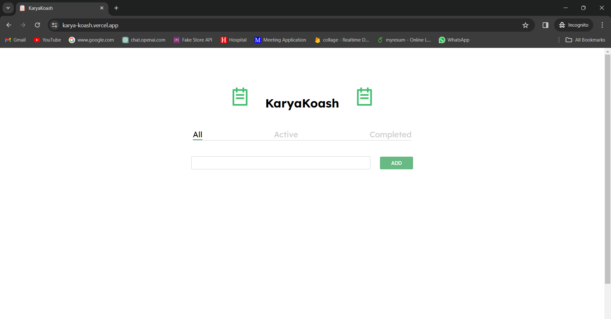
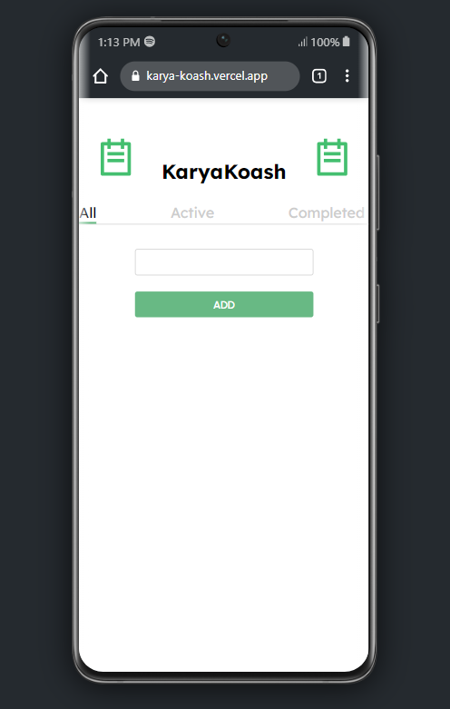
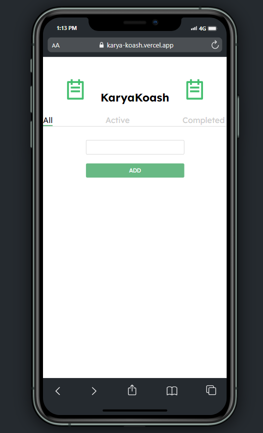
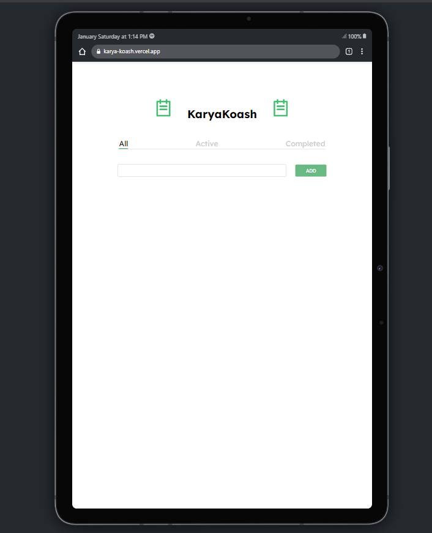
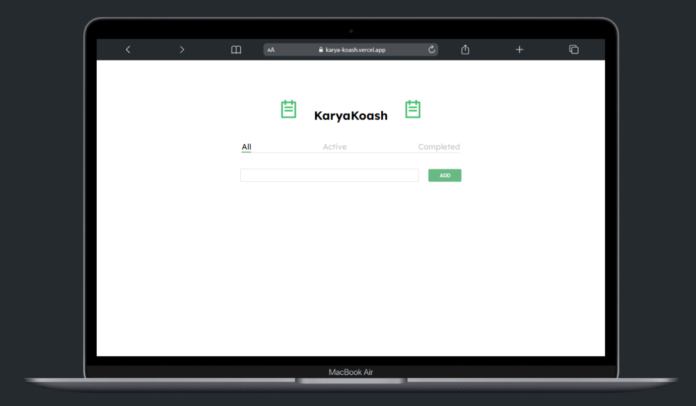

# KaryaKoash - Todo Application

**Live Demo:** [KaryaKoash Live Demo](https://karya-koash.vercel.app/)

## What is KaryaKoash?

"KaryaKoash" is derived from two words:
- "Karya" means work or task in Sanskrit.
- "Koash" is inspired by the phonetic spelling of the word "cache."

Combined, "KaryaKoash" represents a tool to efficiently manage and cache your tasks.

### Technology
## 1.Vite+React
## 2.TypeScript

## App Summary:

KaryaKoash is a modern todo application designed to streamline your task management. It provides a user-friendly interface for organizing daily activities, planning projects, and setting reminders.


## Desktop View



## Mobile View






## Tablet View




## MacBook view




## How to Use:

1. Visit the [Live Demo](https://karya-koash.vercel.app/) to interact with the application.
2. Add new todos by entering task details and clicking the "Add" button.
3. Mark tasks as complete by checking the checkbox.
4. Remove unwanted todos by clicking the delete button.

## Running Locally:

To run the app locally or contribute:

1. Fork the repository.
2. Clone the forked repository to your local machine.
   ```bash
   git clone https://github.com/your-username/karyakoash.git
3. npm install
4. npm start
5. Open your browser and navigate to "http://localhost:5173".

